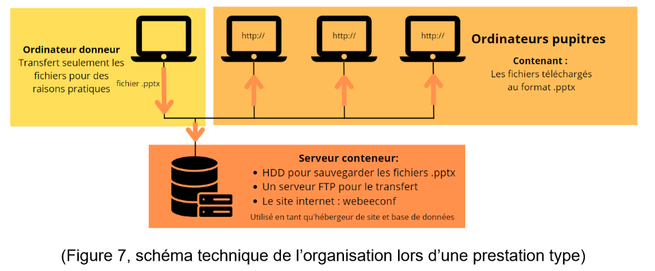
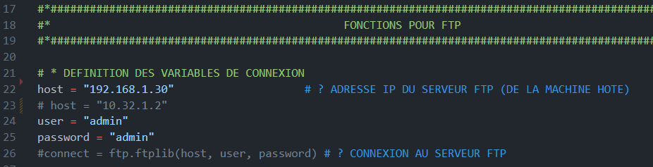

# Partie Preview du projet webeeconf

## Prérequis
Pour la mise en place de cette infrastructure, il est nécessaire d'avoir une architecture de type client-serveur comme indiqué ci-dessous.

### Explications du fonctionnement de l'infrastructure
L'infrastructure est composée de 3 parties :
- Un ou plusieurs pc donneurs qui servent à la récupération des présentations .pptx
- Un serveur qui sert au transfert des présentations et à héberger le site webeeconf/preview ainsi que le serveur FTP
- Un pc pupitre par salle de congrès qui sert de récupérateur de fichier et d'hôte pour le logiciel PowerPoint

### Fonctionnement intrinsèque
Le fonctionnement de l'infrastructure est le suivant :
* Le ou les pc donneurs récupèrent les présentations .pptx et les envoient au serveur
* Le serveur héberge le site webeeconf/preview et les présentations .pptx grâce à un serveur FTP (FileTransfertProtocol)
* Le pc pupitre récupère les présentations .pptx et les stocke dans un dossier local pour les lancer

L'envoie du fichier sur le serveur via la page "upload pptx" se fait grâce à un script python qui envoie le fichier sur le serveur FTP.
Ce faisant, un serveur FTP est nécessaire sur le serveur pour pouvoir recevoir les fichiers.
Dans la configuration actuelle de l'infrastructure, pour faire fonctionner le transfert de fichier il faut désactiver les pare-feux de la machine qui fait tourner le serveur. Une configuration plus poussé et nécessitant des compétences en réseau permettrait de ne pas avoir à désactiver les pare-feux et ainsi limiter les risques liés à la sécurité du système mis en place.

### Installations pour l'infrastructure
Pour installer l'infrastructure, il faut suivre les étapes suivantes :
- Sur le serveur : 
- - Installer un serveur FTP 
- - Installer un serveur web (pour héberger le site webeeconf, non nécessaire à la preview)
- - Désactiver les pare-feux (domaine privé et public)  

 

- Sur le pc donneur :
- - Accéder au site hébergé de preview via l'adresse web (url)  

 

- Sur le pc pupitre :
- - Installer le logiciel PowerPoint
- - Accéder au site hébergé de preview via l'adresse web (url)
- - Lancer le programme "ppt_serveur.py" pour le lancement des fichiers .pptx

## Paramètrage du logiciel
Pour configurer le logiciel correctement, il faut accéder aux fichiers **"views.py"** et **"views.py"** dans leurs dossiers respectifs **planning** et **upload** et procéder au changement des adresses IP concernées.
L'adresse à insérer est celle du serveur FTP.

Pour lancer le fichier ppt_serveur.py automatiquement, il faut le mettre dans le dossier de démarrage de Windows. Pour cela, il faut suivre les étapes suivantes :
- Taper Win+R
- Taper "shell:startup" dans la barre de recherche
- Copier le fichier "ppt_serveur.py" dans le dossier qui s'ouvre
 

Ce fichier doit être configuré avec le chemin d'accès au repertoire du projet (urban garbanzo) depuis le repertoire C.
Si jamais l'ouverture ne se fait pas automatiquement, il suffit de double cliquer sur le fichier pour le lancer.

Dernière étape, il suffit de lancer django en exécutant la commande suivante dans le dossier du projet via un terminal :
"**python manage.py runserver**" le site est alors accessible via l'adresse **127.0.0.1:8000** ou l'adresse de la machine hote sur le réseau local suivi de **":8000"**.
L'environnement de développement python doit être lancé pour la réalisation de cette étape.
Pour ce faire, se rendre dans un terminal dans le dossier du projet et taper la commande suivante :
"**source venv/bin/activate**" pour linux ou "**venv\Scripts\Activate**" pour windows.